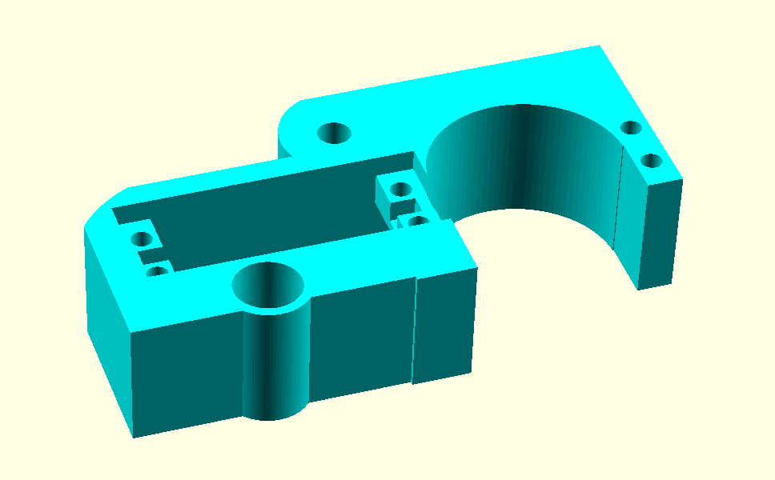
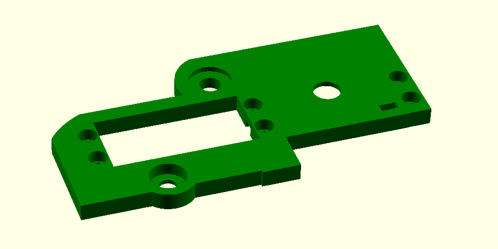
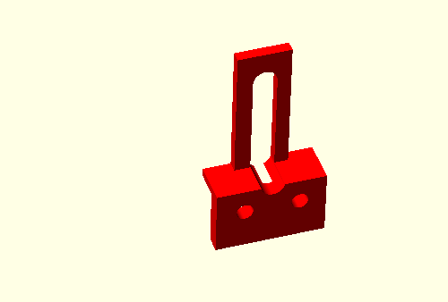
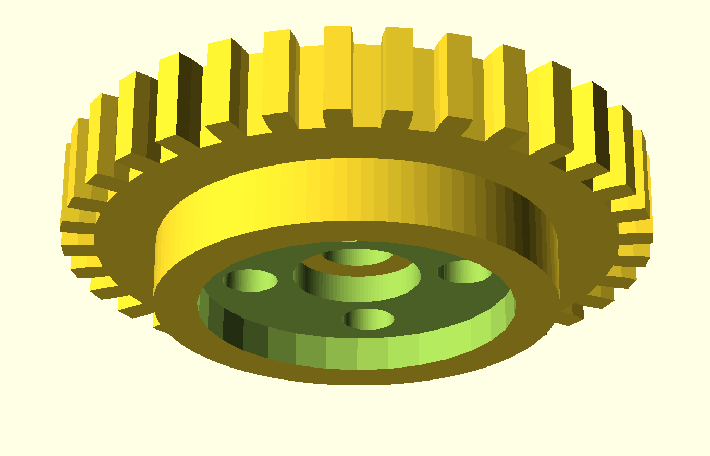
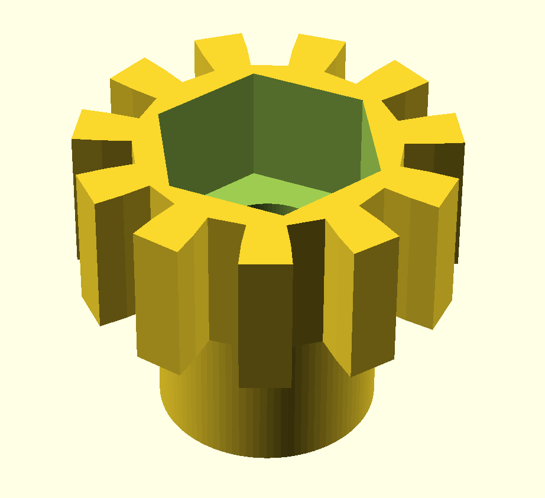
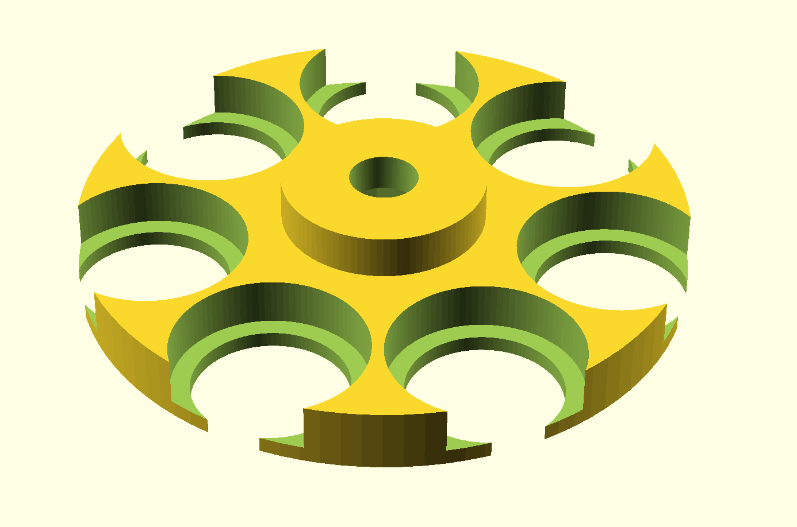

# Automated Multisample Eppendorf Tube Rotator for Beckman Coulter CytoFlex

## Overview
This repository contains the Arduino code and mechanical designs for an automated multisample Eppendorf tube rotator specifically designed to integrate with the Beckman Coulter CytoFlex flow cytometer. This device enhances the cytometer by enabling automated multisampling from up to 7 Eppendorf tubes. It features an automated mechanical lowering mechanism that triggers rotation to align each tube for sampling sequentially, effectively converting the CytoFlex into a multisample flow cytometer.

## Device Gallery

  
  
  

## Features
- **Automated Tube Rotation:** The device automatically rotates to align the next tube once the current sampling process is complete.
- **Invisible Integration:**  Attaches and operates in such a way that the cytometer is unaware of its presence, maintaining all original functionalities.
- **Potentiometer Calibration:** Includes a potentiometer for precise calibration of tube positions, ensuring optimal alignment with the cytometer's sampling mechanism.
- **Arduino-Controlled:** Utilizes an Arduino for easy programming and operational adjustments, providing flexibility and ease of use.

## Components
- Arduino board (Uno, Mega, etc.)
- Servo motor for precise rotation
- Limit switch for automated position detection
- Potentiometer for manual calibration
- Custom-designed holder and mechanical parts for tube rotation
- Standard connecting cables and power supply

## Setup Instructions

## Parts List

## Parts List

| Part Name                         | Download STL                                                                                                 | Screenshot                                  |
|-----------------------------------|-------------------------------------------------------------------------------------------------------------|---------------------------------------------|
| Base                              | [Download Base STL](https://github.com/ccg-esb-lab/cytoflex3D/blob/main/Servo-mount-eppendorf3_base.stl)    |  |
| Mid                               | [Download Mid STL](https://github.com/ccg-esb-lab/cytoflex3D/blob/main/Servo-mount-eppendorf3_mid.stl)      |   |
| Lid                               | [Download Lid STL](https://github.com/ccg-esb-lab/cytoflex3D/blob/main/Servo-mount-eppendorf3_lid.stl)      |   |
| Slider                            | [Download Slider STL](https://github.com/ccg-esb-lab/cytoflex3D/blob/main/Servo-mount-eppendorf3_slider.stl)|  |
| Gear                              | [Download Gear STL](https://github.com/ccg-esb-lab/cytoflex3D/blob/main/Servo-mount-eppendorf3_gear.stl)    |  |
| Small Gear                        | [Download Small Gear STL](https://github.com/ccg-esb-lab/cytoflex3D/blob/main/Servo-mount-eppendorf3_small_gear.stl) |  |
| Holder                            | [Download Holder STL](https://github.com/ccg-esb-lab/cytoflex3D/blob/main/Servo-mount-eppendorf3_holder.stl)|  |

### Hardware Assembly
1. **Mechanical Assembly:** Construct the tube holder and rotation mechanism using the provided 3D designs. Ensure all mechanical connections are secure.
2. **Install the Servo Motor:** Fit the servo motor onto its mount on the assembly.
3. **Set Up the Limit Switch:** Install the limit switch in a location where it will be automatically triggered at the end of each sampling sequence.
4. **Install the Potentiometer:** Place the potentiometer within easy reach for manual adjustments.
5. **Wiring:** Connect the servo, limit switch, and potentiometer to the Arduino as per the wiring diagrams in the repository.

### Software Configuration
- **Upload the Arduino Script:** Flash the Arduino with the script provided in this repository using the Arduino IDE. [View the Arduino code here]([URL_TO_ARDUINO_CODE](https://github.com/ccg-esb-lab/cytoflex3D/edit/main/sketch_cytoflex3D.ino)).
- **Calibrate the Device:** Adjust the potentiometer to fine-tune the rotation steps and ensure that the tubes align perfectly under the sampling mechanism after each rotation.

## Usage
- **Automatic Sampling:** The device lowers into position when the CytoFlex completes sampling from a tube, triggering the limit switch to rotate the assembly and position the next tube automatically.
- **Calibration:** If necessary, tweak the potentiometer to adjust the alignment of the tubes within the sampling area.

## Contributing
Contributions are welcome! Please fork this repository and propose changes through pull requests. For substantial modifications or enhancements, please open an issue first to discuss your ideas.

## License
This project is distributed under the MIT License - see the LICENSE.md file for details.
